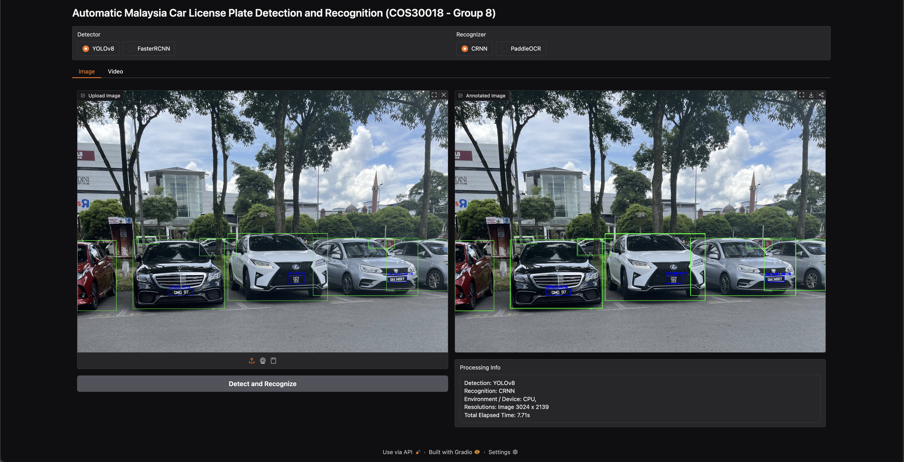

# Automatic Malaysia Car License Plate Detection and Recognition

---

This repository implements a complete ALPR pipeline optimized for Malaysian license plates. Our **best-performing pipeline** uses:

- **YOLOv8n** for detection (vehicle + license plate)  
- **CRNN-Attention** for recognition (optical character recognition)

Click into each subdirectory for step-by-step instructions on training and testing:

- `YOLO` – YOLOv8n setup, data preparation, training & evaluation  
- `CRNN` – CRNN-Attn data pipeline, training notebooks, evaluation  

## Other Models

- **Detection** – `Faster-RCNN`  
- **Recognition** – `PaddleOCR`  
- **Recognition** – `ABINET`  

## Resources

- **Live App**: [Try the Hugging Face Space](LINK_TO_HUGGINGFACE_APP)  
- **Paper**: [View the full report here](LINK_TO_PAPER)  
- **Demo Video**: [Watch the system in action](LINK_TO_DEMO_VIDEO)  

---
